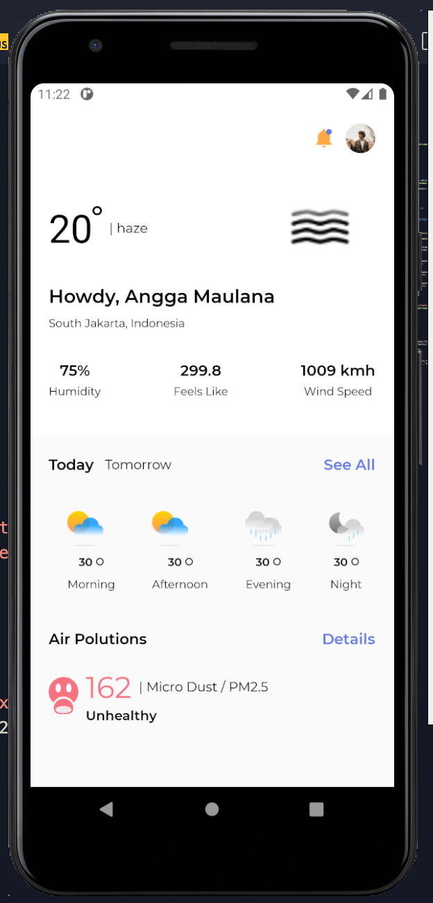
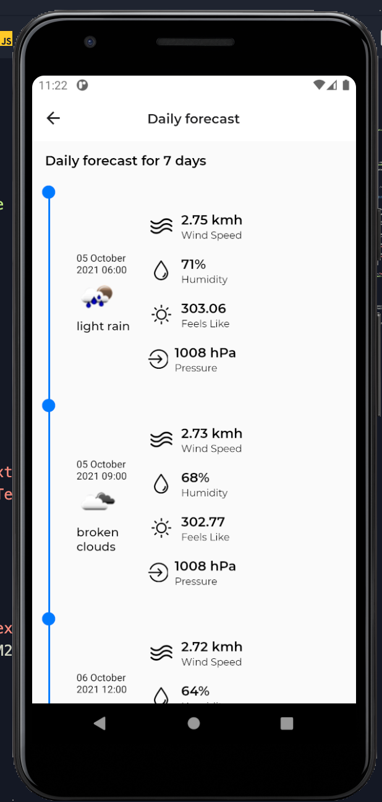

# Welcome to Weather App
## Tech Stack
Osmi Kit apps include the following rock-solid technical decisions out of the box:
- React Native
- React Navigation 5
- OsmiCSX
- AsyncStorage
- apisauce
- Flipper-ready
- Reactotron-ready
- TDD-ready

## Quick Start
The Ignite boilerplate project's structure will look similar to this:
```
osmi-app
├── App
│   ├── Components
│   ├── Config
│   ├── Containers
│   ├── Fixtures
│   ├── Images
│   ├── Lib
│   ├── Navigation
│   ├── Redux
│   ├── Sagas
│   ├── Services
│   ├── Themes
├── Tests
│   ├── Components
│   ├── Services
│   ├── Setup.js
├── android
│   ├── app
│   ├── build.gradle
│   ├── gradle
│   ├── gradle.properties
│   ├── gradlew
│   ├── gradlew.bat
│   ├── keystores
│   └── settings.gradle
├── ios
│   ├── OsmiApp
│   ├── OsmiApp-tvOS
│   ├── OsmiApp-tvOSTests
│   ├── OsmiApp.xcodeproj
│   └── OsmiAppTests
├── index.js
├── .babelrc
├── .eslintrc.js
├── .env.example
├── .gitignore
├── app.json
├── babel.config.js
├── metro.config.js
├── package.json
└── README.md
```

### ./App directory
Included in an Osmi Kit boilerplate project is the app directory. This is a directory you would normally have to create when using vanilla React Native.

The inside of the src directory looks similar to the following:
```
App
├── Components
├── Config
├── Containers
├── Fixtures
├── Images
├── Lib
├── Navigation
├── Redux
├── Sagas
├── Services
└── Themes
```

**Components** This is where your React components will live. Each component will have a directory containing the `.js` file, along with a style file inside `Styles` folder. The app will come with some commonly used components like Button.

**Config** This is where all of your app configuration located like Reactotron config, persist, etc.

**Containers** This is where your screen components will live. A screen is a React component which will take up the entire screen and be part of the navigation hierarchy. Each screen will have a directory containing the `.js` file, along with style file inside `Styles` folder.

**Fixtures** This is where your dummy api will be located. All data stored inside `.json` file.

**Images** This is where all of your local image assets will live. Store all local image asset file and register each image inside `index.js` file.

**Lib** This is where your custom library will live. You can put utility tools, string converter, or any custom helper here.

**Navigation** This is where your navigation will live. All of your live screens will be registered.

**Redux** This is where your Redux will live.

**Sagas** This is where your Sagas will live.

**Services** This is where your app services will live.

**Themes** This is where your app themes will live.


## Preview

|                                          |                                          |                                          |     |
| ---------------------------------------- | ---------------------------------------- | ---------------------------------------- | --- |
|  |  | |     |
|                                          |                                          |                                          |     |
|                                          |                                          |                                          |     |
